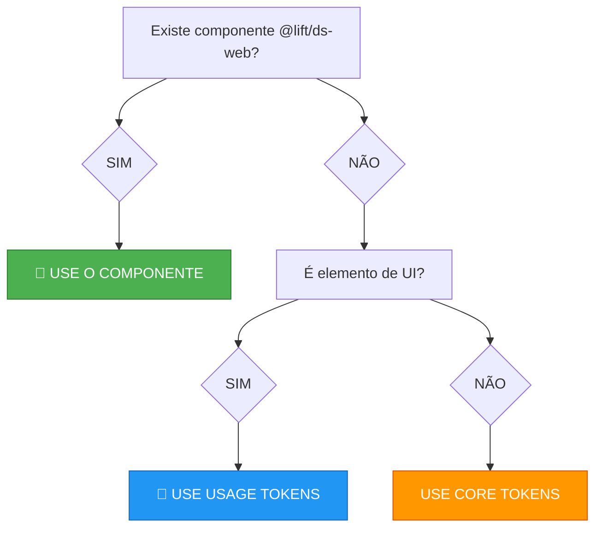
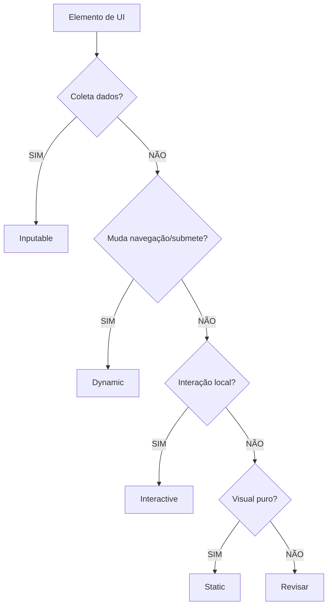

# Lift Design System — Automation & Validation

> Ferramentas programáticas para validação do Design System.
> Para regras decisórias, veja `lift-token-rules.md`.

---

## 1. Regex Patterns

```javascript
// Detectar tokens JS de Usage (LfThm + pelo menos 3 segmentos)
const tokenPattern = /\bLfThm([A-Z][a-z0-9]+){3,}\b/g;

// Detectar CSS custom properties de Usage
const cssVarPattern = /--lf-thm-[a-z]+(?:-[a-z0-9]+)+/g;

// Forbidden Base (qualquer LfBsXxx)
const forbiddenBase = /\bLfBs[A-Z][A-Za-z0-9]*\b/g;

// Forbidden Brand (LfThmBrandXxx)
const forbiddenBrand = /\bLfThmBrand[A-Z][A-Za-z0-9]*\b/g;

// Forbidden CSS Base
const forbiddenCssBase = /--lf-bs-[a-z0-9-]+/g;

// Forbidden CSS Brand
const forbiddenCssBrand = /--lf-thm-brand-[a-z0-9-]+/g;

// Hardcoded hex colors
const hardcodedHex = /#[0-9A-Fa-f]{3,8}\b/g;
```

---

## 2. WCAG Contrast Algorithm

```typescript
function channelToLinear(c: number): number {
  const s = c / 255;
  return s <= 0.03928 ? s / 12.92 : Math.pow((s + 0.055) / 1.055, 2.4);
}

function relativeLuminance(hex: string): number {
  const r = parseInt(hex.slice(1, 3), 16);
  const g = parseInt(hex.slice(3, 5), 16);
  const b = parseInt(hex.slice(5, 7), 16);
  return 0.2126 * channelToLinear(r) + 0.7152 * channelToLinear(g) + 0.0722 * channelToLinear(b);
}

function contrastRatio(hex1: string, hex2: string): number {
  const L1 = relativeLuminance(hex1);
  const L2 = relativeLuminance(hex2);
  const lighter = Math.max(L1, L2);
  const darker = Math.min(L1, L2);
  return (lighter + 0.05) / (darker + 0.05);
}

// Thresholds
const WCAG_AA_NORMAL = 4.5;
const WCAG_AA_LARGE = 3.0;
const WCAG_AAA_NORMAL = 7.0;
```

---

## 3. Pairing Validation Function

```typescript
interface Token {
  name: string;
  group: string;
  hierarchy: string;
  role: string;
  layer: string;
  modifier?: string;
}

interface ValidationResult {
  valid: boolean;
  errors: string[];
  warnings: string[];
  suggestedFix?: { background: Token; foreground: Token };
}

function validatePairing(bg: Token, fg: Token): ValidationResult {
  const errors: string[] = [];
  const warnings: string[] = [];

  // Same group required
  if (bg.group !== fg.group) {
    errors.push(`Different groups: bg="${bg.group}", fg="${fg.group}"`);
  }

  // Same hierarchy required
  if (bg.hierarchy !== fg.hierarchy) {
    errors.push(`Different hierarchies: bg="${bg.hierarchy}", fg="${fg.hierarchy}"`);
  }

  // Container requires On Container
  if (bg.role === 'Container' && fg.role !== 'On Container') {
    errors.push(`Container bg requires On Container fg. Found: "${fg.role}"`);
  }

  // Surface cannot pair with On Container
  if (bg.role === 'Surface' && fg.role === 'On Container') {
    errors.push(`Surface bg cannot pair with On Container. Use On Surface.`);
  }

  // Base/Brand forbidden
  if (['base', 'brand'].includes(bg.layer) || ['base', 'brand'].includes(fg.layer)) {
    errors.push(`Base/Brand tokens forbidden in runtime UI`);
  }

  // Variant consistency
  if (bg.modifier?.includes('Inverse') !== fg.modifier?.includes('Inverse')) {
    warnings.push(`Mixing Normal and Inverse variants`);
  }

  return { valid: errors.length === 0, errors, warnings };
}
```

---

## 4. ESLint Rule: no-forbidden-tokens

```javascript
// eslint-plugin-lift-ds/rules/no-forbidden-tokens.js
module.exports = {
  meta: {
    type: 'problem',
    docs: {
      description: 'Forbid Base and Brand tokens in UI components',
      category: 'Lift Design System',
      recommended: true,
    },
    messages: {
      forbiddenBase: 'Never use Base tokens (LfBs*) in UI. Use Usage tokens (LfThm*) instead.',
      forbiddenBrand: 'Never use Brand tokens (LfThmBrand*) in UI. Use Usage tokens instead.',
      missingComponent: 'Consider using @lift/ds-web component "{{component}}" instead of manual tokens.',
    },
    schema: [],
  },

  create(context) {
    const forbiddenBasePattern = /\bLfBs[A-Z][A-Za-z0-9]*\b/;
    const forbiddenBrandPattern = /\bLfThmBrand[A-Z][A-Za-z0-9]*\b/;

    const componentSuggestions = {
      'LfThmDynamicPrimarySurface': 'LfButton',
      'LfThmInteractivePrimarySurface': 'LfAccordion',
      'LfThmInputableFieldNeutralSurface': 'LfInput',
    };

    return {
      Identifier(node) {
        const name = node.name;
        if (forbiddenBasePattern.test(name)) {
          context.report({ node, messageId: 'forbiddenBase' });
        }
        if (forbiddenBrandPattern.test(name)) {
          context.report({ node, messageId: 'forbiddenBrand' });
        }
        for (const [prefix, component] of Object.entries(componentSuggestions)) {
          if (name.startsWith(prefix)) {
            context.report({ node, messageId: 'missingComponent', data: { component } });
          }
        }
      },

      Literal(node) {
        if (typeof node.value !== 'string') return;
        if (node.value.includes('--lf-bs-')) {
          context.report({ node, messageId: 'forbiddenBase' });
        }
        if (node.value.includes('--lf-thm-brand-')) {
          context.report({ node, messageId: 'forbiddenBrand' });
        }
      },
    };
  },
};
```

**Uso no `.eslintrc.js`:**

```javascript
module.exports = {
  plugins: ['lift-ds'],
  rules: {
    'lift-ds/no-forbidden-tokens': 'error',
    'lift-ds/validate-surface-pairing': 'warn',
  },
};
```

---

## 5. Jest Tests

```typescript
import { contrastRatio } from './contrast';
import enrichedTokens from '../docs/tokens-figma-enriched.json';

describe('Lift Token Validation', () => {
  test('no Base or Brand tokens in UI code', () => {
    const code = `const x = LfThmDynamicPrimarySurfaceDefault; const y = LfBsColorPrimary500;`;
    const baseMatches = code.match(/\bLfBs[A-Z][A-Za-z0-9]*\b/g) || [];
    expect(baseMatches).toEqual(['LfBsColorPrimary500']);
  });

  test('surface/on-surface pair has same group and hierarchy', () => {
    const bg = enrichedTokens.find(t => t.name === 'LfThmDynamicPrimarySurfaceDefault');
    const fg = enrichedTokens.find(t => t.name === 'LfThmDynamicPrimaryOnSurfaceDefault');
    expect(bg.category).toBe(fg.category);
    expect(bg.segments[1]).toBe(fg.segments[1]);
  });

  test('contrast meets WCAG AA for normal text', () => {
    const ratio = contrastRatio('#076AEA', '#FFFFFF');
    expect(ratio).toBeGreaterThanOrEqual(4.5);
  });

  test('all usage tokens have valid structure', () => {
    const usageTokens = enrichedTokens.filter(t => t.layer === 'usage');
    usageTokens.forEach(token => {
      expect(token.segments.length).toBeGreaterThanOrEqual(3);
      expect(token.name).toMatch(/^LfThm[A-Z]/);
      expect(token.cssProperty).toBeDefined();
    });
  });
});
```

---

## 6. Design Smell Detection

| Smell ID | Severity | Description |
|----------|----------|-------------|
| `multiple-primary-actions` | Warning | > 1 Primary action in same viewport |
| `clickable-static` | Error | Static token on interactive element |
| `missing-hover-state` | Warning | Interactive without hover token |
| `missing-focus-ring` | Error | Focusable without focus state |
| `hardcoded-hex` | Error | Direct color instead of token |
| `mixed-semantic-groups` | Error | Surface/On Surface from different groups |
| `container-without-on-container` | Error | Invalid container pairing |
| `dynamic-without-action` | Warning | Dynamic token on non-action element |
| `inverse-mixed-normal` | Warning | Variant inconsistency |
| `low-contrast` | Error | WCAG AA failure |
| `excessive-critical-actions` | Warning | > 2 destructive actions visible |
| `orphan-elevation` | Warning | Shadow without semantic surface |
| `surface-without-onsurface` | Error | Background without foreground |
| `inputable-on-button` | Error | Form field tokens on submit |
| `static-on-link` | Error | Static tokens on navigation |

---

## 7. JSON Schema for Enriched Tokens

```json
{
  "type": "object",
  "required": ["name", "path", "segments", "layer", "role", "cssProperty"],
  "properties": {
    "name": { "type": "string", "pattern": "^LfThm[A-Za-z0-9]+$" },
    "path": { "type": "string" },
    "segments": { "type": "array", "items": { "type": "string" }, "minItems": 3 },
    "category": { "type": "string" },
    "layer": { "type": "string", "enum": ["base", "brand", "usage", "component"] },
    "value": { "type": "string" },
    "isColor": { "type": "boolean" },
    "context": { "type": "string" },
    "aliasChain": { "type": "array", "items": { "type": "string" } },
    "role": { "type": "string" },
    "cssProperty": { "type": "string" }
  }
}
```

---

## 8. Mermaid Diagrams

**Quick Decision Tree:**



**Group Classification:**



---

*Lift Design System Automation — v2.1.1*
